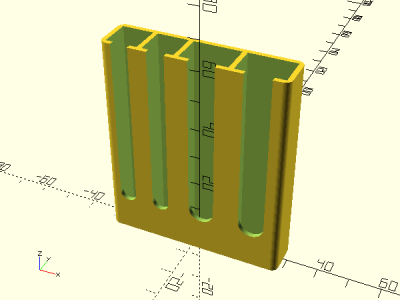

# Parametric Ned Bait Holder

<table>
<tr>
<td></td>
<td></td>
</tr>
<tr>
<td></td>
</tr>
</table>

A simple container to hold Ned rig baits. Ideal for river fishing in waders with few pockets, and for keeping ElaZtech baits separate from PVC baits. Default parameters yields a four slot container, suitable for 2-4" soft plastic stick baits, tubes, craws, etc. Number of slots, slot widths, height, depth, and wall thickness are customizable parameters. Made with OpenSCAD.

**Design:** [ned_bait_holder.scad](ned_bait_holder.scad)

**STL:** [ned_bait_holder.stl](stl/ned_bait_holder.stl)

**Recommended Print Settings:** 0.20mm layer height, default infill, no supports

**Thingiverse:** https://www.thingiverse.com/thing:4641126

**License**: 
